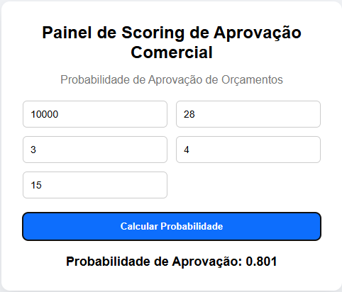

# 💼 Aprovação de Orçamentos com Regressão Logística

Sistema de classificação probabilística de orçamentos comerciais, utilizando Regressão Logística, normalização estatística, API REST e interface web explicável.

O sistema responde à pergunta:
**“Qual a probabilidade real deste orçamento ser aprovado?”**

Retornando um valor entre 0 e 1, acompanhado de classificação interpretável.

---

## 🎯 Objetivo do Projeto

Demonstrar, de forma prática e didática, como funciona um motor de decisão comercial baseado em Machine Learning, utilizando:
- Regressão Logística
- Função Sigmoide
- Normalização (Z-score)
- API REST com Flask
- Interface Web interativa

---

## 🧠 Conceito Matemático

O modelo utiliza a equação:

```text
y = b₀ + b₁x₁ + b₂x₂ + b₃x₃ + b₄x₄ + b₅x₅
```

Aplicando a função sigmoide:

```text
p = 1 / (1 + e⁻ʸ)
```

Onde `p` representa a probabilidade de aprovação.

Os coeficientes `b` não são definidos manualmente - eles são aprendidos automaticamente durante o treinamento.

---

## 🧠 O que é o Treinamento de Máquina

O treinamento é o processo onde o algoritmo analisa milhares de exemplos de orçamentos e aprende quais características aumentam ou reduzem a chance de aprovação.

Durante o treino, o modelo ajusta os coeficientes b₀, b₁, b₂, b₃, b₄, b₅ para minimizar erros de previsão.

Esses coeficientes representam os pesos reais de cada variável na decisão comercial.

---

## 🧾 Campos da Interface

| Campo | Tipo | Significado |
|------|-----|-------------|
| Valor do orçamento | Float (R$) | Valor total do orçamento |
| Prazo (dias) | Int | Prazo oferecido ao cliente |
| Desconto (%) | Int | Percentual de desconto |
| Relacionamento (1–5) | Int | Nível de relacionamento comercial |
| Histórico de compras | Int | Quantidade de compras anteriores |

Quanto maior o relacionamento e histórico, maior a probabilidade de aprovação.
Quanto maior o valor e o desconto, menor a probabilidade.

---

## 📊 Classificação

| Probabilidade | Interpretação |
|--------------|---------------|
| ≥ 0.70 | Alta chance de aprovação |
| 0.40 – 0.69 | Risco |
| < 0.40 | Baixa chance |

---

## 📦 Requirements

```txt
flask
numpy
pandas
scikit-learn
```
---

## 🖥 Interface (vazia)


---

## 🖥 Interface (com teste)




---

## ▶️ Como Executar

1. Criar ambiente virtual
```bash
python -m venv venv
venv\Scripts\activate
```

2. Instalar dependências
```bash
pip install -r requirements.txt
```

3. Executar pipeline de ML
```bash
python main.py
```

4. Subir a API
```bash
python api/app.py
```

5. Acessar no navegador
```
http://127.0.0.1:5000
```

---

## 💎 Valor do Projeto

Este projeto demonstra:
- Pipeline completo de Machine Learning
- Modelo matematicamente explicável
- API REST pronta para SaaS
- Interface web interativa
- Classificação probabilística real

---

📌 Projeto ideal para portfólio em Ciência de Dados, IA aplicada e sistemas de decisão comercial.
