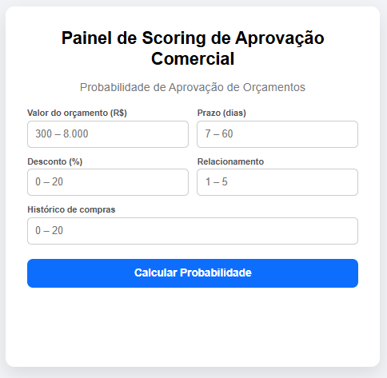
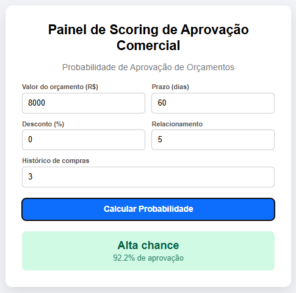
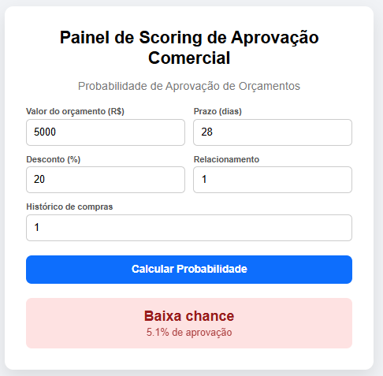

# 💼 Aprovação de Orçamentos com Regressão Logística

Sistema de classificação probabilística de orçamentos comerciais, utilizando Regressão Logística, normalização estatística, API REST e interface web explicável.

O sistema responde à pergunta:
**“Qual a probabilidade real deste orçamento ser aprovado?”**

Retornando um valor entre 0 e 1, acompanhado de classificação interpretável.

---

## 🎯 Objetivo do Projeto

Demonstrar, de forma prática e didática, como funciona um motor de decisão comercial baseado em Machine Learning, utilizando:
- Regressão Logística implementada do zero com NumPy
- Função Sigmoide com estabilidade numérica
- Normalização (Z-score) persistida junto ao modelo
- Avaliação completa: Accuracy, Precision, Recall, F1-Score, ROC-AUC
- API REST com Flask e validação de entrada
- Interface Web interativa com feedback visual por status

---

## 🧠 Conceito Matemático

O modelo utiliza a equação:

```text
y = b₀ + b₁x₁ + b₂x₂ + b₃x₃ + b₄x₄ + b₅x₅
```

\Aplicando a função sigmoide:

```text
p = 1 / (1 + e⁻ʸ)
```

Onde `p` representa a probabilidade de aprovação.

Os coeficientes `b` não são definidos manualmente - eles são aprendidos automaticamente durante o treinamento.

---

## 🧠 O que é o Treinamento de Máquina

O treinamento é o processo onde o algoritmo analisa milhares de exemplos de orçamentos e aprende quais características aumentam ou reduzem a chance de aprovação.

Durante o treino, o modelo ajusta os coeficientes `b₀, b₁, b₂, b₃, b₄, b₅` para minimizar erros de previsão.

Esses coeficientes representam os pesos reais de cada variável na decisão comercial.

---

## 🧾 Campos da Interface

| Campo | Tipo | Intervalo | Significado |
|------|-----|-----------|-------------|
| Valor do orçamento | Float (R$) | 300 – 8.000 | Valor total do orçamento |
| Prazo (dias) | Int | 7 – 60 | Prazo oferecido ao cliente |
| Desconto (%) | Int | 0 – 20 | Percentual de desconto |
| Relacionamento | Int | 1 – 5 | Nível de relacionamento comercial |
| Histórico de compras | Int | 0 – 20 | Quantidade de compras anteriores |

Todos os campos são validados no cliente e no servidor. Entradas fora do intervalo retornam erro antes de qualquer predição.

---

## ⚖️ Peso de cada Campo

O modelo aprende automaticamente o impacto de cada variável no resultado final:

| Campo | Impacto no Resultado |
|------|---------------------|
| Valor do orçamento | Impacto negativo (quanto maior, menor a chance) |
| Prazo | Impacto positivo |
| Desconto | Impacto negativo |
| Relacionamento | Impacto muito positivo |
| Histórico de compras | Impacto muito positivo |

---

Quanto maior o relacionamento e histórico, maior a probabilidade de aprovação.
Quanto maior o valor e o desconto, menor a probabilidade.

---

## 📊 Classificação

| Probabilidade | Status | Cor |
|--------------|--------|-----|
| ≥ 0.70 | Alta chance de aprovação | Verde |
| 0.40 – 0.69 | Risco | Amarelo |
| < 0.40 | Baixa chance | Vermelho |

---

## 📈 Métricas de Avaliação

O modelo é avaliado com threshold de 0.5 sobre o conjunto de teste (20% dos dados):

| Métrica | Descrição |
|---------|-----------|
| Accuracy | Percentual de acertos geral |
| Precision | Dos aprovados previstos, quantos eram reais |
| Recall | Dos aprovados reais, quantos foram capturados |
| F1-Score | Média harmônica entre Precision e Recall |
| ROC-AUC | Capacidade discriminativa geral do modelo |

---

## 🖥 Interface (vazia)



---

## 🖥 Interface (teste — aprovação positiva)



---

## 🖥 Interface (teste — aprovação negativa)



---

## 📦 Requirements

```txt
flask
numpy
pandas
scikit-learn
```

---

## ▶️ Como Executar

1. Criar ambiente virtual
```bash
python -m venv venv
venv\Scripts\activate
```

2. Instalar dependências
```bash
pip install -r requirements.txt
```

3. Executar pipeline de ML (gera dados, treina e avalia o modelo)
```bash
python main.py
```

4. Subir a API
```bash
python api/app.py
```

> Para habilitar o modo debug: `FLASK_DEBUG=true python api/app.py`

5. Acessar no navegador
```
http://127.0.0.1:5000
```
---

## 🗂 Estrutura do Projeto

```
├── data/
│   └── gerar_dados.py       # Geração sintética com seed, ruído e split correto
├── model/
│   ├── logistic.py          # Regressão logística do zero (NumPy)
│   ├── train.py             # Pipeline de treino com Z-score
│   ├── evaluate.py          # Avaliação completa de métricas
│   └── save_load.py         # Persistência do modelo
├── api/
│   ├── app.py               # API Flask com validação e tratamento de erros
│   └── static/              # Interface web (HTML, CSS, JS)
├── assets/                  # Screenshots da interface
├── main.py                  # Orquestrador do pipeline completo
└── requirements.txt
```

---

## 💎 Valor do Projeto

Este projeto demonstra:
- Pipeline completo de Machine Learning do zero ao deploy
- Modelo matematicamente explicável, sem uso de sklearn para treino
- Geração de dados realista com ruído e split sem vazamento
- Validação de entrada em duas camadas (cliente e servidor)
- Avaliação com métricas além de accuracy (Precision, Recall, F1, ROC-AUC)
- API REST com tratamento de erros e modo debug via variável de ambiente
- Interface web com feedback visual por classificação de risco

---

📌 Projeto de Ciência de Dados, IA aplicada e sistemas de decisão comercial.
