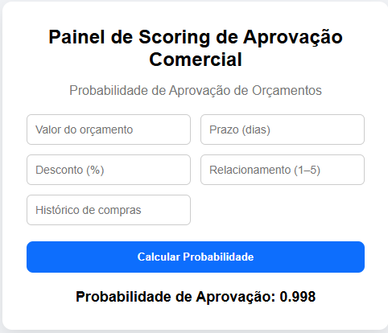
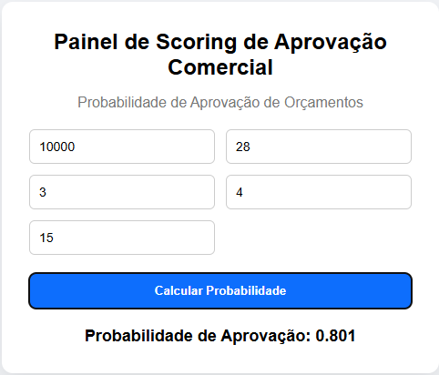

# 💼 Aprovação de Orçamentos com Regressão Logística

Sistema de classificação probabilística de orçamentos comerciais, utilizando Regressão Logística, normalização estatística, API REST e interface web explicável.

O sistema responde à pergunta:
**“Qual a probabilidade real deste orçamento ser aprovado?”**

Retornando um valor entre 0 e 1, acompanhado de classificação interpretável.

---

## 🎯 Objetivo do Projeto

Demonstrar, de forma prática e didática, como funciona um motor de decisão comercial baseado em Machine Learning, utilizando:
- Regressão Logística implementada do zero com NumPy
- Função Sigmoide com estabilidade numérica
- Normalização (Z-score) persistida junto ao modelo
- Avaliação completa: Accuracy, Precision, Recall, F1-Score, ROC-AUC
- API REST com Flask e validação de entrada
- Interface Web interativa com feedback visual por status

---

## 🧠 Conceito Matemático

O modelo utiliza a equação:

```text
y = b₀ + b₁x₁ + b₂x₂ + b₃x₃ + b₄x₄ + b₅x₅
```

\Aplicando a função sigmoide:

```text
p = 1 / (1 + e⁻ʸ)
```

Onde `p` representa a probabilidade de aprovação.

Os coeficientes `b` não são definidos manualmente - eles são aprendidos automaticamente durante o treinamento.

---

## 🧠 O que é o Treinamento de Máquina

O treinamento é o processo onde o algoritmo analisa milhares de exemplos de orçamentos e aprende quais características aumentam ou reduzem a chance de aprovação.

Durante o treino, o modelo ajusta os coeficientes `b₀, b₁, b₂, b₃, b₄, b₅` para minimizar erros de previsão.

Esses coeficientes representam os pesos reais de cada variável na decisão comercial.

---

## 🧾 Campos da Interface

| Campo | Tipo | Significado |
|------|-----|-------------|
| Valor do orçamento | Float (R$) | Valor total do orçamento |
| Prazo (dias) | Int | Prazo oferecido ao cliente |
| Desconto (%) | Int | Percentual de desconto |
| Relacionamento (1–5) | Int | Nível de relacionamento comercial |
| Histórico de compras | Int | Quantidade de compras anteriores |

---

## ⚖️ Peso de cada Campo

O modelo aprende automaticamente o impacto de cada variável no resultado final:

| Campo | Impacto no Resultado |
|------|---------------------|
| Valor do orçamento | Impacto negativo (quanto maior, menor a chance) |
| Prazo | Impacto positivo |
| Desconto | Impacto negativo |
| Relacionamento | Impacto muito positivo |
| Histórico de compras | Impacto muito positivo |

---

Quanto maior o relacionamento e histórico, maior a probabilidade de aprovação.
Quanto maior o valor e o desconto, menor a probabilidade.

---

## 📊 Classificação

| Probabilidade | Status | Cor |
|--------------|--------|-----|
| ≥ 0.70 | Alta chance de aprovação | Verde |
| 0.40 – 0.69 | Risco | Amarelo |
| < 0.40 | Baixa chance | Vermelho |

---

## 📈 Métricas de Avaliação

O modelo é avaliado com threshold de 0.5 sobre o conjunto de teste (20% dos dados):

| Métrica | Descrição |
|---------|-----------|
| Accuracy | Percentual de acertos geral |
| Precision | Dos aprovados previstos, quantos eram reais |
| Recall | Dos aprovados reais, quantos foram capturados |
| F1-Score | Média harmônica entre Precision e Recall |
| ROC-AUC | Capacidade discriminativa geral do modelo |

---

## 🖥 Interface (vazia)



---

## 🖥 Interface (com teste)



---

## 📦 Requirements

```txt
flask
numpy
pandas
scikit-learn
```

---

## ▶️ Como Executar

1. Criar ambiente virtual
```bash
python -m venv venv
venv\Scripts\activate
```

2. Instalar dependências
```bash
pip install -r requirements.txt
```

3. Executar pipeline de ML
```bash
python main.py
```

4. Subir a API
```bash
python api/app.py
```

5. Acessar no navegador
```
http://127.0.0.1:5000

```
---

## 💎 Valor do Projeto

Este projeto demonstra:
- Pipeline completo de Machine Learning
- Modelo matematicamente explicável
- API REST pronta para SaaS
- Interface web interativa
- Classificação probabilística real

---

📌 Projeto ideal para portfólio em Ciência de Dados, IA aplicada e sistemas de decisão comercial.
